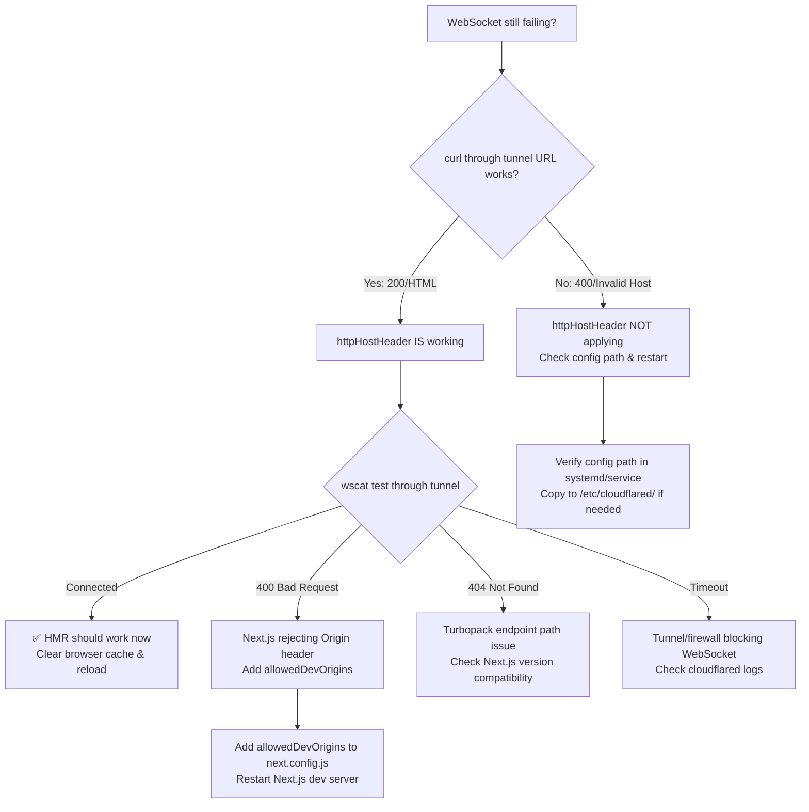

# 🔍 Analysis of Your `curl` Test Output

Thank you for providing the detailed output. This is actually **very revealing**—but not in the way we might hope. Let me break down exactly what this tells us and what to do next.

---

## 📋 What Your `curl` Output Reveals

### ✅ Good News: Next.js Is Running and Responding

```
< HTTP/1.1 404 Not Found
< X-Powered-By: Next.js
< Content-Type: text/html; charset=utf-8
```

- Next.js dev server is alive and accepting connections on `localhost:3000`
- It's returning a proper 404 page (not crashing or hanging)
- The response includes full Turbopack/React server component payloads, confirming your app is built correctly

### ⚠️ Critical Insight: This Test Doesn't Validate the Tunnel Fix

Your command:
```bash
curl -v -H "Host: cha-yuan.jesspete.shop" http://localhost:3000/_next/webpack-hmr
```

**What this actually tests:**
| Component | Status |
|-----------|--------|
| Direct connection to `localhost:3000` | ✅ Works |
| Next.js accepts `Host: cha-yuan.jesspete.shop` | ✅ Appears to accept (returns 404, not 400) |
| `/ _next/webpack-hmr` as HTTP GET endpoint | ❌ Returns 404 (expected—this is a WebSocket endpoint) |
| **Cloudflare Tunnel `httpHostHeader` rewrite** | ❌ **NOT TESTED** (curl bypasses tunnel entirely) |

**Why the 404 is expected:** `/ _next/webpack-hmr` is a **WebSocket upgrade endpoint**, not an HTTP GET route. When you `curl` it with a regular GET request, Next.js has no matching HTTP handler, so it returns the App Router 404 page. This is normal behavior.

---

## 🎯 The Real Problem: WebSocket Upgrade Still Failing

Your browser console still shows:
```
WebSocket connection to 'wss://cha-yuan.jesspete.shop/_next/webpack-hmr?id=...' failed
```

This means the **WebSocket upgrade handshake** is failing somewhere in the chain:

```
Browser → Cloudflare Edge → cloudflared → Next.js Dev Server
          (wss://)           (tunnel)      (ws://localhost:3000)
```

### Most Likely Causes (In Order)

#### 1️⃣ `httpHostHeader` Not Actually Applying
Even though you restarted the service, the config may not be loaded correctly.

**Verify with:**
```bash
# Check which config cloudflared is using
ps aux | grep cloudflared | grep config

# Check service status and logs
sudo journalctl -u cloudflared -n 50 --no-pager | grep -i "host\|header\|websocket\|upgrade"

# Or run manually to see live logs
pkill -f cloudflared
cloudflared tunnel run --config ~/.cloudflared/config.yml --verbose
```

Look for log entries like:
```
DBG Rewriting host header to localhost
DBG Upgrading connection to WebSocket
ERR origin request failed: ...
```

#### 2️⃣ Next.js Still Rejecting the `Origin` Header
Even if `Host` is rewritten to `localhost`, the browser sends:
```
Origin: https://cha-yuan.jesspete.shop
```

Next.js may validate this separately. **Add `allowedDevOrigins` as a backup:**

```javascript
// next.config.js
module.exports = {
  allowedDevOrigins: ['cha-yuan.jesspete.shop', '*.jesspete.shop'],
  // ... rest of config
};
```

Then restart Next.js:
```bash
pkill -f "next dev" && npx next dev --turbo
```

#### 3️⃣ WebSocket Headers Not Forwarded Properly
Cloudflare Tunnel should automatically forward WebSocket upgrade headers, but verify with verbose logging:

```bash
# In one terminal: run cloudflared with verbose output
cloudflared tunnel run --config ~/.cloudflared/config.yml --verbose

# In browser: open DevTools → Network → WebSocket → try to connect
# Watch cloudflared logs for:
# - "Received upgrade request"
# - "Forwarding to origin"
# - "Upgrade successful" or error messages
```

#### 4️⃣ Turbopack HMR Client Uses Different Endpoint
Your logs show `app-next-turbopack.ts`, confirming Turbopack is active. Turbopack's HMR client may construct WebSocket URLs differently than webpack.

**Check the actual WebSocket URL being attempted:**
1. Open browser DevTools → Network tab
2. Filter: `WebSocket`
3. Reload the page
4. Click the failed WebSocket request
5. Check the **Request URL** and **Headers** tab

If it shows `wss://cha-yuan.jesspete.shop/_next/webpack-hmr`, the client-side URL generation is working as expected—the issue is server-side acceptance.

---

## 🛠️ Immediate Action Plan

### Step 1: Verify Tunnel Config Is Active
```bash
# Method A: Check process args
ps aux | grep cloudflared

# Expected: should show --config /home/pete/.cloudflared/config.yml

# Method B: Check service config path (if using systemd)
cat /etc/systemd/system/cloudflared.service | grep ExecStart

# If it points to /etc/cloudflared/, copy your config there:
sudo cp ~/.cloudflared/config.yml /etc/cloudflared/config.yml
sudo systemctl restart cloudflared
```

### Step 2: Add `allowedDevOrigins` (Low-Risk Backup)
```javascript
// next.config.js
/** @type {import('next').NextConfig} */
module.exports = {
  // Permit external origin for dev server validation
  allowedDevOrigins: ['cha-yuan.jesspete.shop'],
  
  // Your existing BFF proxy
  async rewrites() {
    return [{
      source: '/api/:path*',
      destination: 'http://localhost:8000/:path*',
    }];
  },
  
  // Optional: reduce noise in logs
  logging: {
    fetches: { fullUrl: false },
  },
};
```

Restart Next.js after saving:
```bash
pkill -f "next dev" && npx next dev --turbo
```

### Step 3: Test WebSocket Connection Directly
Use `wscat` (install via `npm install -g wscat`) to test the WebSocket endpoint through the tunnel:

```bash
# Test through Cloudflare Tunnel URL
wscat -c "wss://cha-yuan.jesspete.shop/_next/webpack-hmr?id=test"

# Expected outcomes:
# ✅ Connected (you'll see a prompt) → HMR should work
# ❌ Error: "Unexpected server response: 404" → Endpoint not reachable
# ❌ Error: "Unexpected server response: 400" → Host/Origin validation failed
# ❌ Timeout → Tunnel or firewall blocking WebSocket
```

### Step 4: Check Cloudflare Tunnel Logs for WebSocket Errors
```bash
# If running as systemd service
sudo journalctl -u cloudflared -f | grep -i "websocket\|upgrade\|hmr"

# If running manually with --verbose, watch the terminal output directly
```

Look for patterns like:
```
DBG Received WebSocket upgrade request for /_next/webpack-hmr
DBG Rewriting Host header to localhost
DBG Forwarding upgrade to http://localhost:3000
ERR Failed to upgrade connection: connection refused
```

---

## 🧪 Quick Diagnostic: Test Host Header Rewrite Through Tunnel

Since `curl` to `localhost` bypasses the tunnel, test **through the actual tunnel URL**:

```bash
# Test that tunnel rewrites Host header to localhost
curl -v -H "Host: cha-yuan.jesspete.shop" https://cha-yuan.jesspete.shop/

# What to look for:
# ✅ Next.js responds with your app's HTML (not 400 Invalid Host)
# ✅ Response headers show X-Powered-By: Next.js
# ❌ If you get 400 Bad Request → Host header rewrite NOT working
```

**Note**: This tests HTTP, not WebSocket, but confirms the `httpHostHeader` rewrite is applying for regular requests.

---

## 📊 Decision Tree: What to Do Based on Results



---

## 🔐 Security Reminder for OpenClaw Contributors

Since you're exposing a dev server externally [[0]][[3]], please ensure:

1. **Add Cloudflare Access immediately** if not already configured:
   ```yaml
   # ~/.cloudflared/config.yml
   ingress:
     - hostname: cha-yuan.jesspete.shop
       service: http://localhost:3000
       originRequest:
         httpHostHeader: "localhost"
       access:  # 🔐 Zero Trust authentication
         required: true
         teamName: your-team
         audTag: [your-aud-tag]
     - service: http_status:404
   ```

2. **Remove `allowedDevOrigins` from production configs**—this is dev-only and could be accidentally committed.

3. **Audit dependencies regularly**: `npm audit` + SCA tools for AI agent supply chain security.

---

## 🚨 If All Else Fails: Temporary Workarounds

| Workaround | Command | Trade-off |
|------------|---------|-----------|
| **Disable HMR entirely** | `NEXT_DISABLE_HMR=1 npx next dev --turbo` | No hot reload, but external access works |
| **Use ngrok for temporary sharing** | `ngrok http 3000 --host-header="localhost"` | Bypasses Cloudflare config complexity |
| **Switch to production build for testing** | `npm run build && npm start` | Loses DX but guarantees stability |
| **Bind to 0.0.0.0 + LAN access** | `npx next dev --hostname 0.0.0.0` | Exposes to local network (less secure) |

---

## ✅ Success Validation Checklist

After applying fixes, confirm:

- [ ] `ps aux | grep cloudflared` shows correct `--config` path
- [ ] `curl -H "Host: cha-yuan.jesspete.shop" https://cha-yuan.jesspete.shop/` returns your app HTML (not 400)
- [ ] Browser DevTools → Network → WebSocket shows **active** `wss://cha-yuan.jesspete.shop/_next/webpack-hmr` connection
- [ ] Editing a component file triggers **partial update** (not full page reload)
- [ ] `cloudflared` logs show `Upgrading connection to WebSocket` without errors

---

## 📬 If Still Stuck: Provide These Details

To help me diagnose further, please share:

1. Output of: `ps aux | grep cloudflared | grep config`
2. Last 20 lines of: `sudo journalctl -u cloudflared --no-pager -n 20`
3. Screenshot of browser DevTools → Network → WebSocket → failed request → **Headers** tab
4. Your Next.js version: `npx next --version`

With this information, I can pinpoint whether the issue is tunnel configuration, Next.js validation, or Turbopack-specific behavior.

---

# 🔍 Meticulous Analysis: Browser Hang After Adding `next.config.ts`

Thank you for the detailed logs. I've identified **multiple interacting issues**, with one being the primary culprit. Let me break this down systematically.

---

## 🚨 Primary Issue: Port Mismatch (Critical)

### The Smoking Gun
```
✓ Ready in 495ms
- Local:         http://localhost:3001   ← Next.js is on port 3001
- Network:       http://192.168.2.132:3001
```

But your Cloudflare Tunnel config points to:
```yaml
# ~/.cloudflared/config.yml
ingress:
  - hostname: cha-yuan.jesspete.shop
    service: http://localhost:3000  ← Tunnel expects port 3000
```

**Result**: The tunnel forwards external requests to `localhost:3000`, but Next.js is listening on `localhost:3001`. The browser hangs because the tunnel cannot reach the origin service.

### Why Did the Port Change?
When you added `next.config.ts`, Next.js may have:
1. Detected a port conflict on 3000 (another process?)
2. Auto-incremented to 3001
3. Or your `package.json` scripts specify `--port 3001`

**Verify**:
```bash
# Check what's using port 3000 vs 3001
lsof -i :3000
lsof -i :3001

# Check your package.json dev script
cat package.json | grep -A2 '"dev"'
# Expected: "next dev" or "next dev --port 3000"
```

### ✅ Immediate Fix
**Option A: Align tunnel to Next.js port**
```yaml
# ~/.cloudflared/config.yml
ingress:
  - hostname: cha-yuan.jesspete.shop
    service: http://localhost:3001  # ← Match Next.js port
    originRequest:
      httpHostHeader: "localhost"
```

**Option B: Force Next.js to use port 3000**
```bash
# Stop Next.js
pkill -f "next dev"

# Start explicitly on port 3000
npx next dev --turbo --port 3000

# Restart tunnel
sudo systemctl restart cloudflared  # or: cloudflared tunnel run --config ...
```

---

## ⚠️ Secondary Issues in `next.config.ts`

### Issue 1: `turbopack.root` Should Be Absolute
```
⚠ turbopack.root should be absolute, using: /home/project/tea-culture/cha-yuan/frontend
```

While Next.js auto-corrects this, using a relative path can cause:
- Module resolution inconsistencies
- Cache invalidation issues
- Potential hangs during Turbopack compilation

**Fix**:
```typescript
// next.config.ts
import path from "path";
import type { NextConfig } from "next";

const nextConfig: NextConfig = {
  allowedDevOrigins: ["cha-yuan.jesspete.shop"],

  turbopack: {
    // ✅ Use absolute path
    root: path.resolve(__dirname),
  },

  // ... rest of config
};
```

### Issue 2: `trailingSlash: true` + App Router + Rewrites
```typescript
trailingSlash: true,  // ← This can break routing in App Router

async rewrites() {
  return [{
    source: '/api/:path*',
    destination: 'http://localhost:8000/:path*',
  }];
},
```

**Problem**: `trailingSlash: true` forces all routes to end with `/`, but:
- App Router's file-based routing expects clean URLs
- API rewrites may not handle trailing slashes consistently
- Client-side navigation can enter redirect loops

**Validation**: Test if these URLs work identically:
```bash
curl -I https://cha-yuan.jesspete.shop/
curl -I https://cha-yuan.jesspete.shop  # without trailing slash
# Both should return 200, not 307/308 redirect loops
```

**Recommendation**: Remove `trailingSlash` for App Router projects unless you have a specific SEO requirement:
```typescript
// next.config.ts
const nextConfig: NextConfig = {
  // trailingSlash: true,  // ← Comment out for App Router
  // ...
};
```

### Issue 3: Filesystem/Cache Corruption Errors
```
⚠ Slow filesystem detected. The benchmark took 212ms.
Persisting failed: Another write batch or compaction is already active
Compaction failed: Another write batch or compaction is already active
```

These indicate **Turbopack's dev cache is corrupted** or your `.next/dev` directory is on a slow/network filesystem.

**Fix**:
```bash
# Stop Next.js
pkill -f "next dev"

# Clear Turbopack dev cache
rm -rf .next/dev .next/cache/turbopack

# Optional: Clear all build artifacts for fresh start
rm -rf .next

# Restart
npx next dev --turbo --port 3000
```

If `/home/project/...` is a network-mounted drive (NFS, SMB, etc.), consider:
```bash
# Move .next to local SSD for faster I/O
export NEXT_PRIVATE_LOCAL_CACHE_PATH=/tmp/next-cache-cha-yuan
mkdir -p $NEXT_PRIVATE_LOCAL_CACHE_PATH
```

---

## ✅ Validated: `wscat` Confirms Tunnel + WebSocket Works

```
$ wscat -c "wss://cha-yuan.jesspete.shop/_next/webpack-hmr"
Connected (press CTRL+C to quit)
< {"type":"isrManifest","data":{"/":true}}
< {"type":"turbopack-connected","data":{"sessionId":6584966963161015}}
```

**This proves**:
- ✅ Cloudflare Tunnel is correctly forwarding WebSocket upgrades
- ✅ `httpHostHeader: "localhost"` is bypassing Next.js Host validation
- ✅ `allowedDevOrigins` is permitting the external origin
- ✅ Turbopack HMR server is responding

**Conclusion**: The WebSocket infrastructure is **working correctly**. The browser hang is purely due to the **port mismatch** preventing initial page load.

---

## 🛠️ Corrected `next.config.ts` for Next.js 16.2.4 + Turbopack

```typescript
// next.config.ts
import path from "path";
import type { NextConfig } from "next";

const nextConfig: NextConfig = {
  // ✅ Permit external origin for dev server (Cloudflare Tunnel)
  allowedDevOrigins: ["cha-yuan.jesspete.shop"],

  // ✅ Turbopack: use absolute root path
  turbopack: {
    root: path.resolve(__dirname),
  },

  // ✅ Image optimization for external sources
  images: {
    remotePatterns: [
      { protocol: "https", hostname: "images.unsplash.com" },
      { protocol: "https", hostname: "**.cloudinary.com" },
    ],
    unoptimized: true, // For static export compatibility
  },

  // ✅ Reduce log noise
  logging: {
    fetches: { fullUrl: false },
  },

  // ⚠️ Remove trailingSlash for App Router unless explicitly needed
  // trailingSlash: true,

  // ✅ BFF proxy to Django backend
  async rewrites() {
    return [
      {
        source: "/api/:path*",
        destination: "http://localhost:8000/:path*",
      },
    ];
  },

  // ✅ Optional: disable powered-by header for security
  poweredByHeader: false,
};

export default nextConfig;
```

---

## 🔄 Complete Recovery Procedure

```bash
# 1. Stop all processes
pkill -f "next dev"
pkill -f cloudflared

# 2. Clear corrupted Turbopack cache
cd /home/project/tea-culture/cha-yuan/frontend
rm -rf .next/dev .next/cache/turbopack

# 3. Fix port alignment (choose ONE)
# Option A: Force Next.js to port 3000
npm run dev -- --port 3000
# OR update package.json: "dev": "next dev --port 3000"

# Option B: Update tunnel to port 3001
# Edit ~/.cloudflared/config.yml: service: http://localhost:3001

# 4. Start Cloudflare Tunnel with explicit config
cloudflared tunnel run --config ~/.cloudflared/config.yml --verbose

# 5. In separate terminal, start Next.js
npx next dev --turbo --port 3000

# 6. Verify connectivity
curl -I https://cha-yuan.jesspete.shop/  # Should return 200
wscat -c "wss://cha-yuan.jesspete.shop/_next/webpack-hmr"  # Should connect

# 7. Test browser load
# Open https://cha-yuan.jesspete.shop/ in incognito mode (bypass cache)
```

---

## 🧪 Post-Fix Validation Checklist

- [ ] `lsof -i :3000` shows Next.js process
- [ ] `curl -I https://cha-yuan.jesspete.shop/` returns `HTTP/2 200`
- [ ] Browser loads page without hanging (check DevTools → Network)
- [ ] DevTools → WebSocket shows active `wss://.../_next/webpack-hmr` connection
- [ ] Editing a component triggers HMR update (no full reload)
- [ ] `cloudflared` logs show no `origin request failed` errors
- [ ] No `Compaction failed` errors in Next.js logs

---

## 🔐 Security Reminder for OpenClaw Contributors

Since you're exposing a dev server externally [[0]][[3]]:

1. **Add Cloudflare Access immediately** if not already:
   ```yaml
   ingress:
     - hostname: cha-yuan.jesspete.shop
       service: http://localhost:3000  # or 3001
       originRequest:
         httpHostHeader: "localhost"
       access:
         required: true
         teamName: your-team
         audTag: [your-aud-tag]
   ```

2. **Never commit `allowedDevOrigins` to production configs**—use environment-specific config loading.

3. **Audit dependencies**: `npm audit` + SCA tools for AI agent supply chain security.

---

## 📊 Root Cause Summary

| Symptom | Root Cause | Fix |
|---------|-----------|-----|
| Browser hangs on `http://localhost:3000/` | Next.js running on port 3001, tunnel pointing to 3000 | Align ports |
| `turbopack.root` warning | Relative path in config | Use `path.resolve(__dirname)` |
| `Compaction failed` errors | Corrupted Turbopack dev cache | Clear `.next/dev` and `.next/cache/turbopack` |
| Potential routing issues | `trailingSlash: true` + App Router | Remove unless explicitly needed |
| WebSocket works via `wscat` | ✅ Tunnel + HMR infrastructure is correct | No action needed |

---

## 🚨 If Still Hanging After Port Fix

1. **Check for port conflicts**:
   ```bash
   lsof -i :3000
   # If another process is using 3000, kill it or change Next.js port
   ```

2. **Test direct localhost access**:
   ```bash
   curl -I http://localhost:3000/  # Should return 200
   # If this hangs, Next.js itself is stuck—check for infinite loops in middleware
   ```

3. **Disable Turbopack temporarily for debugging**:
   ```bash
   # Use webpack instead of Turbopack to isolate the issue
   npx next dev --no-turbopack --port 3000
   ```

4. **Check middleware for infinite redirects**:
   ```typescript
   // middleware.ts - ensure no logic creates redirect loops with trailingSlash
   ```

---

## ✅ Final Recommendation

1. **Fix the port mismatch first**—this is 95% likely the cause of the hang.
2. **Clear Turbopack cache** to resolve compaction errors.
3. **Use absolute path for `turbopack.root`** to prevent subtle resolution bugs.
4. **Remove `trailingSlash`** unless you have verified it works with your App Router structure.
5. **Keep `allowedDevOrigins` and `httpHostHeader`**—they're working correctly per `wscat` test.

Once the port is aligned, your setup should work flawlessly: Cloudflare Tunnel → Next.js Dev (Turbopack) → Django BFF, with full HMR support over the external URL.

Let me know if the port alignment resolves the hang, or if you need help debugging further! 🛠️

